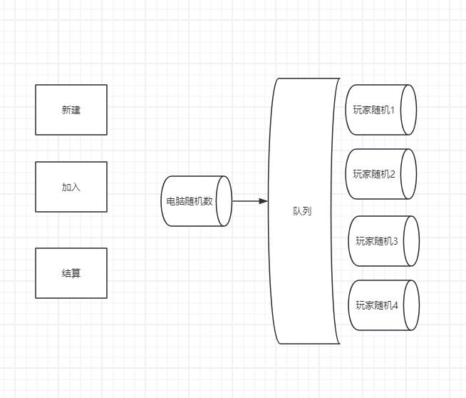

# 链上战斗coChainFight

## 简介
链上战斗游戏是一种运用区块链技术的互动应用。通常涉及玩家之间的竞争或合作。在这种游戏中，智能合约扮演着核心角色，负责处理游戏逻辑、分数计算、奖励分配以及确保所有操作的透明性和不可篡改性。

以下是一份链上战斗游戏智能合约的简介：

### 游戏概述

链上战斗游戏是一种多人在线游戏，玩家通过随机数的大小来战斗判断胜负用已提升角色分数和获取奖励。

### 特点

充分利用aptos链上随机数功能 实现公平化计算输赢算法

角色注册：允许玩家创建和注册新的战斗角色。
战斗逻辑：处理战斗过程中的逻辑，包括攻击、防御和特殊技能的使用。
分数计算：根据战斗结果计算玩家的分数。
奖励分配：根据玩家的表现分配奖励，如代币、NFT或其他虚拟物品。
史记录：记录所有战斗结果和玩家的战斗历史。

### 分值战斗
战斗结构图,利用队列形式分别进行判断后
给每个参与的组员增加相应的分值

合约发布
Do you want to submit a transaction for a range of [159600 - 239400] Octas at a gas unit price of 100 Octas? [yes/no] >
yes
Transaction submitted: https://explorer.aptoslabs.com/txn/0xb03acdb4c27f02a4273a40fcd7345906c3baec57dc966ad3cc0e3c3285cd1bed?network=testnet
{
"Result": {
"transaction_hash": "0xb03acdb4c27f02a4273a40fcd7345906c3baec57dc966ad3cc0e3c3285cd1bed",
"gas_used": 1596,
"gas_unit_price": 100,
"sender": "387dbba8446f119057a1648f91a87564cfffc46c0b04d9a0007d603cf61d98bb",
"sequence_number": 1,
"success": true,
"timestamp_us": 1728027466381911,
"version": 6083805128,
"vm_status": "Executed successfully"
}
}

